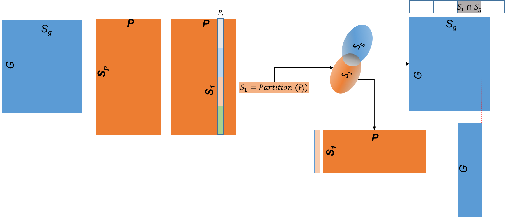
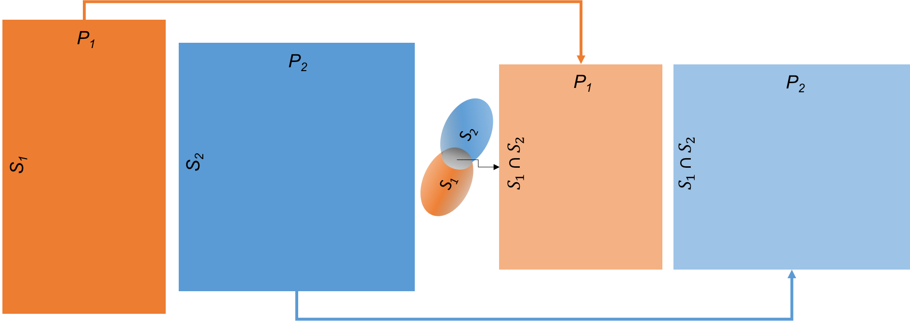
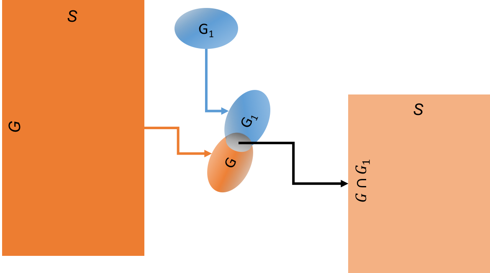
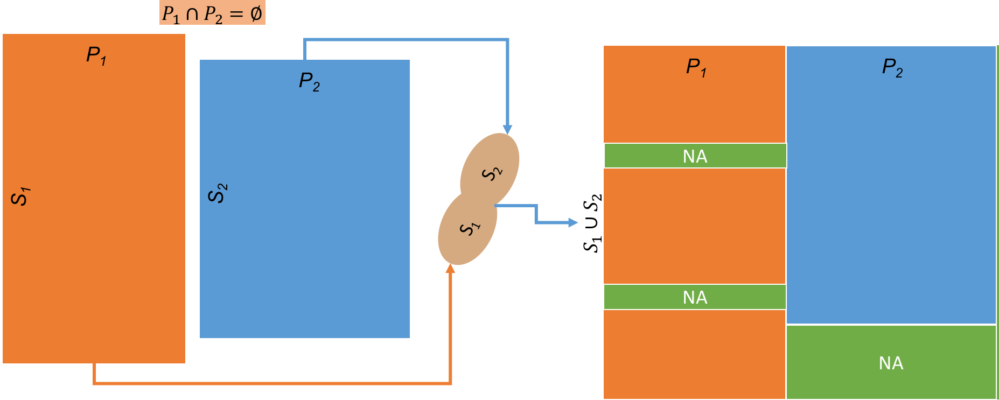
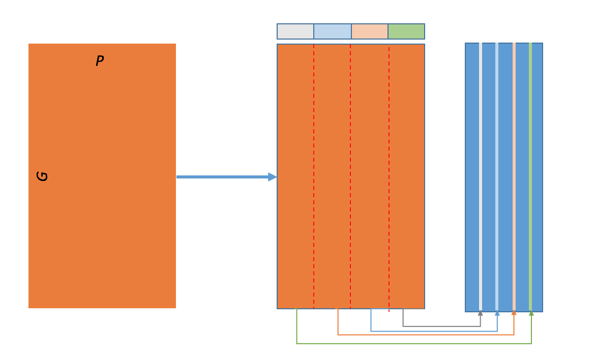

# KnowEnG's Spreadsheets Transformation pipeline

This is the Knowledge Engine for Genomics (KnowEnG), an NIH BD2K Center of Excellence, Spreadsheets Transformation Pipeline.

This pipeline applies various transformations to one or more Spreadsheets (Genomic, Phenotypic, ...)

There are eight transformation methods that one can choose from:

| **Options**                                      | **Method**                           | **Parameters**       |
| ------------------------------------------------ | -------------------------------------| -------------------- |
| Subset Based on Phenotype category and id        | select subtype                 | spreadsheet, phenotype, id, category|
| Intersection                                     | common samples                       | two spreadsheets     |
| Subset Genes                                     | select genes                         | spreadsheet, list     |
| Union                                            | merge                                | two spreadsheets     |
| Group Then Apply a Function                      | cluster statistics                   | spreadsheet, labels   |
| Spreadsheet numerical transform                  | numerical transform            | spreadsheet, transformation name|
| Spreadsheet statistics                           | stats                          | spreadsheet, statistic name|
| Spreadsheet transpose                            | run_transpose                        | one spreadsheet |
| Kaplan-Meier                            | run_kaplan_meier                        | spreadsheet, cluster_id, event, time |
| Spreadsheet category to binary                            | run_category_binary        | spreadsheet, category |

## Table of Transformations
---
1. Subset Based on Phenotype category and id
2. Intersection
3. Subset Genes
4. Union
5. Group then apply a function
6. Spreadsheet numerical transform
7. Spreadsheet statistics
8. Spreadsheet transpose
9. Kaplan-Meier
10. Category to Binary

## 1. Subset Based on a Phenotype category and category name

Subset samples based on some phenotype column value, e.g., patients with longer survival. Output can 
be a smaller spreadsheet and possibly with fewer columns.

<p align="center">
  
</p>


## 2. Intersection

Finds the intersection between two spreadsheets row names and keep the column names of the two spreadsheets as is.
Output is two spreadsheets with only the genes (rows) in common.

<p align="center">
  
</p>

## 3. Subset Genes

Subset the initial spreadsheet's rows based on a given row index names set.

<p align="center">
  
</p>

## 4. Union

Merge two phenotype spreadsheets such that the final spreadsheet contains all columns names and row names.

<p align="center">
  
</p>

## 5.  Group Then Apply a Function

Given expression spreadsheet and a group-samples-by criterion, e.g. the mean gene value for each sample-cluster assignment.

<p align="center">
  
</p>

## 6. Spreadsheet numerical transform 

Spreadsheet with new numerical values, such as; threshold, log transform, z transform or absolute value.

## 7. Spreadsheet statistics

Spreadsheet measure overall, by rows or columns such as; min, max, sum, mean, median, standard deviation or variation.

## 8. Spreadsheet transpose

Spreadsheet rows x columns transposed to columns x rows.

## 9. Kaplan-Meier

Samples x phenotype spreadsheet, with clusters ID, event and time columns output to Kaplan-Meier plot as png image.

## 10. Category to Binary

Samples x phenotype spreadsheet, select category column, output samples x unique-categories binary spreadsheet.


* * * 
## How to run this pipeline with Our data.
* * * 

 ### 1. Install the following (Ubuntu or Linux).
  ```
 apt-get install -y python3-pip
 apt-get install -y libfreetype6-dev libxft-dev
 apt-get install -y libblas-dev liblapack-dev libatlas-base-dev gfortran

 pip3 install numpy==1.11.1
 pip3 install pandas==0.18.1 
 pip3 install scipy==0.18.0
 pip3 install scikit-learn==0.17.1
 pip3 install matplotlib==1.4.2
 pip3 install pyyaml
 pip3 install xmlrunner
 pip3 install knpackage
```

### 2. Clone the Spreadsheets_Transformation github repository to your computer.
```
 git clone https://github.com/KnowEnG-Research/Spreadsheets_Transformation.git
```

### 3. Change directory to Spreadsheets_Transformation.
```
cd Spreadsheets_Transformation
```

### 4. Change to the test directory.

```
cd test
```
 
### 5. Run "make" to create a local directory "run_dir" and place all the run files in it
```
make env_setup
```

### 6. Use one of the following "make" commands to select and run a transformation option:


| **Command**         | **Options and input file names**                                       | 
|:------------------- |:------------------------------------------------ | 
| make run_spreadsheet_transpose              | TEST_1_transpose.yml |
| make run_spreadsheets_common_samples       | TEST_2_common_samples.yml |
| make run_spreadsheets_merge             | TEST_3_merge.yml |
| make run_select_spreadsheet_genes   | TEST_4_select_genes.ym |
| make run_spreadsheet_clustering_averages  | TEST_5_cluster_averages.yml |
| make run_spreadsheet_select_pheno_categorical | TEST_6_select_categorical.yml|
| make run_numerical_tranform | TEST_7_numerical_transform.yml|
| make run_stat_values | TEST_8_stat_value.yml |
| make run_kaplan_meier | TEST_9_kaplan_meier.yml |
| make run_category_binary | TEST_10_categorical_to_bin.yml |

### 7. Ouput files will be written to the results directory named in the Options file, using the name(s) of the input files as appended with the transformation name and a timestamp.


* * * 
## How to run this pipeline with your data.
* * * 
### 1. Copy and edit the TEST_..._options.yml file most appropriate for your transformation, 
* include the name and location of your input file(s) 
* set additional options as commented in the file
* set the path to your results directory
* suggested directory setup is like that created with ```make env_setup```

### 2. Run the pipeline from the command line with the edited options file in the run directory.
```
python3 mini_pipelines.py -run_directory your/run_directory/path -run_file your_options.yml
```

* * *
## How to run the Spreadsheets_Transformation.ipynb Jupyter notebook.
* * * 

### 1. Install Jupyter and the widgets.
```
http://jupyter.readthedocs.io/en/latest/install.html

http://ipywidgets.readthedocs.io/en/stable/user_install.html
```

### 2. Clone this repository using the directions in step 2 above.
```
git clone https://github.com/KnowEnG-Research/Spreadsheets_Transformation.git
```

### 3. Start the jupyter notebook server at the command prompt.
```
jupyter notebook
```

### 4. The Jupyter notebook server should open in your default browser - if not follow the directions in the terminal.

* In the notbook server window navigate to the directory with the Spreadsheets_Transformation.ipynb notebook and click on it to start it in an new tab.

* If you don't see a simple page with forms and buttons then you will have to select "Cell" > "Run All" in the Jupyter menu.

* You may upload your files in the notebook server window or use the default files. The output will be in the "results" directory.
