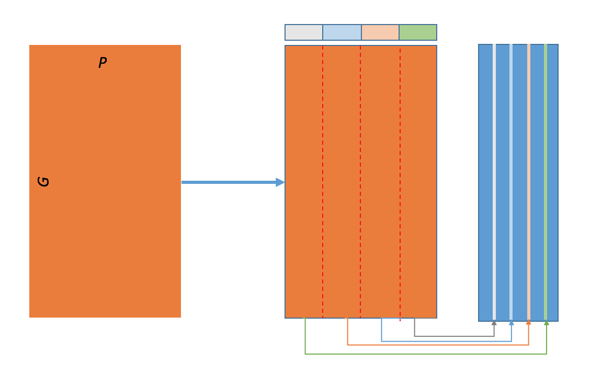

# KnowEnG Spreadsheets Transformation methods
Apply various transformations on one or more Spreadsheets (Genomic, Phenotypic, ...)

There are eight data wrangling methods that one can choose from:

| **Options**                                      | **Method**                           | **Parameters**       |
| ------------------------------------------------ | -------------------------------------| -------------------- |
| Subset Expression Based on Phenotype             | select subtype                 | spreadsheet, phenotype, id, category|
| Intersection                                     | common samples                       | two spreadsheets     |
| Subset Genes                                     | select genes                         | spreadsheet, list     |
| Union                                            | merge                                | two spreadsheets     |
| Group Then Apply a Function                      | cluster statistics                   | spreadsheet, labels   |
| Spreadsheet numerical transform                  | numerical transform            | spreadsheet, transformation name|
| Spreadsheet statistics                           | stats                          | spreadsheet, statistic name|
| Transpose a spreadsheet                          | run_transpose                        | one spreadsheet |

## Table of Transformtions
---
1. Subset Expression Based on Phenotype
2. Intersection
3. Subset Genes
4. Union
5. Group Then Apply a Function

## 1. Subset Expression Based on Phenotype

Subset samples based on some row value, e.g., patients with longer survival. Output can 
be a smaller spreadsheet and possibly with fewer columns.

<p align="center">
  
</p>


## 2. Intersection

Finds the intersection between two spreadsheets row names and keep the column names of the two spreadsheets as is.
Output is a  spreadsheet more columns with potentially fewer rows.

<p align="center">
  
</p>

## 3. Subset Genes

Subset the initial spreadsheet's rows based on a given row index names set.

<p align="center">
  
</p>

## 4. Union

Merge two phenotype spreadsheets such that the final spreadsheet contains all columns names and row names.

<p align="center">
  
</p>

## 5.  Group Then Apply a Function

Given expression spreadsheet and a group-samples-by criterion, create for example the centroid of each group as a signature. 

<p align="center">
  
</p>


* * * 
## How to run this pipeline with Our data
* * * 
### 1. Clone the Spreadsheets_Transformation Repo
```
 git clone https://github.com/KnowEnG-Research/Spreadsheets_Transformation.git
```
 
### 2. Install the following (Ubuntu or Linux)
  ```
 apt-get install -y python3-pip
 apt-get install -y libfreetype6-dev libxft-dev
 apt-get install -y libblas-dev liblapack-dev libatlas-base-dev gfortran

 pip3 install pyyaml
 pip3 install knpackage
 pip3 install redis
 pip3 install numpy==1.11.1
 pip3 install pandas==0.18.1 
 pip3 install scipy==0.18.0
 pip3 install scikit-learn==0.17.1
 pip3 install matplotlib==1.4.2
 pip3 install xmlrunner
```

### 3. Change directory to Spreadsheets_Transformatio

```
cd Spreadsheets_Transformatio
```

### 4. Change directory to test

```
cd test
```
 
### 5. Run "make" to create a local directory "run_dir" and place all the run files in it
```
make env_setup
```

### 6. Use one of the following "make" commands to select and run a transformation option:


| **Command**         | **Option**                                       | 
|:------------------- |:------------------------------------------------ | 
| make run_spreadsheet_transpose              | Transpose |
| make run_spreadsheets_common_samples       | Common samples in two spreadsheets|
| make run_spreadsheets_merge             | Merge two spreadsheets with common header|
| make run_select_spreadsheet_genes   | Select the genes in a spreadsheet from a list|
| make run_spreadsheet_clustering_averages  | Get the averages for a labeling of samples in a spreadsheet|
| make run_spreadsheet_select_pheno_categorical | Select category of a phenotype id. in phenotype and spreadsheet|
| make run_numerical_tranform | Numerical transformation of a spreadsheet|
| make run_stat_values | Get a value statistic for a spreadsheet|

