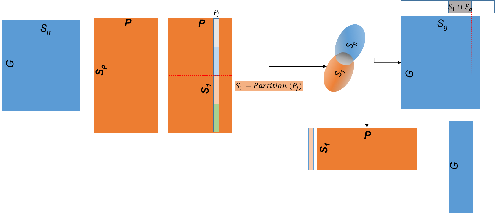
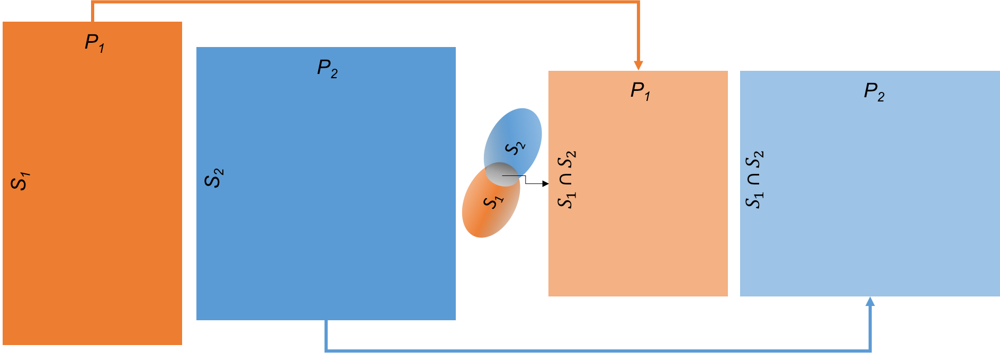
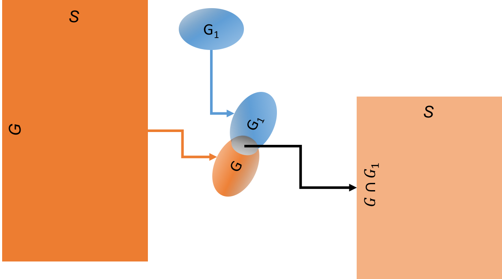
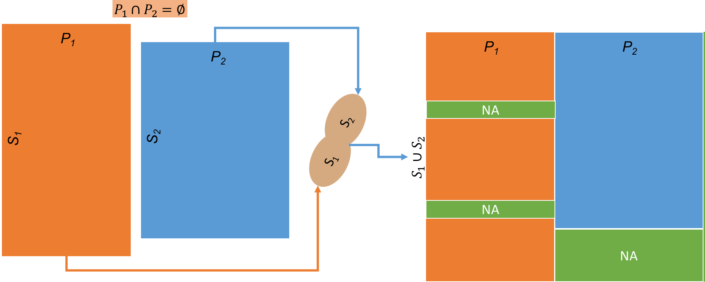

# Spreadsheets Transformation
Apply various transformations on one or more Spreadsheets (Genomic, Phenotypic, ...)

## Table of Transformtions
---
1. Subset Expression Based on Phenotype
2. Intersection
3. Subset Genes
4. Union
5. Group Then Apply a Function

## 1. Subset Expression Based on Phenotype

  

## 2. Intersection

  

## 3. Subset Genes

  

## 4. Union

  

## 5. Group Then Apply a Function

  

