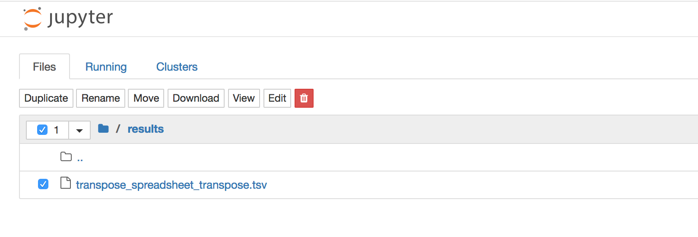

# KnowEnG's Spreadsheets Transformation Jupyter notebook

This is the Knowledge Engine for Genomics (KnowEnG), an NIH BD2K Center of Excellence, Spreadsheets Transformation Pipeline.

This pipeline applies various transformations to one or more Spreadsheets (Genomic, Phenotypic, ...)

There are eight transformation methods that one can choose from:

## Table of Transformtions
---
1. Subset Based on Phenotype category and id
2. Intersection
3. Subset Genes
4. Union
5. Group then apply a function
6. Spreadsheet numerical transform
7. Spreadsheet statistics
8. Spreadsheet transpose

# Using the KnowEnG Spreadsheets_Transformation.ipynb notebook.
 ---
 
## 1) Start the notebook code:
 ---
 
### If your browser allows auto-initialization you will see a screen like this.

  

### If not, and the code is showing, use the _Cell_ menu to _Run All_

  

### Click on any **View** button to see the top of the selected file, click again on **Clear** to hide.

  

### Use listboxes to select parameters where they are shown.

  

### Click on the action button (named by the transform) to display and write the file (s) to _results_.

  

### Use _Kernel_ menu _Restart and Clear Output_ to clear error messages (and all dispalyed output).

  

 

## 3) Upload, view and transform your data:
 ---

### Use the _File_ menu _Open_ . 

  

#### Select the _user_data_ directory.

  

#### Click the _upload_ button to browse your computers files.

  

#### Click the highlighted _upload_ button begin the upload.

  

#### The file will appear in alphabetical order when the upload is complete.

  

### Rename, download or delete your files in the _user_data_ or _results_ directory.

  

